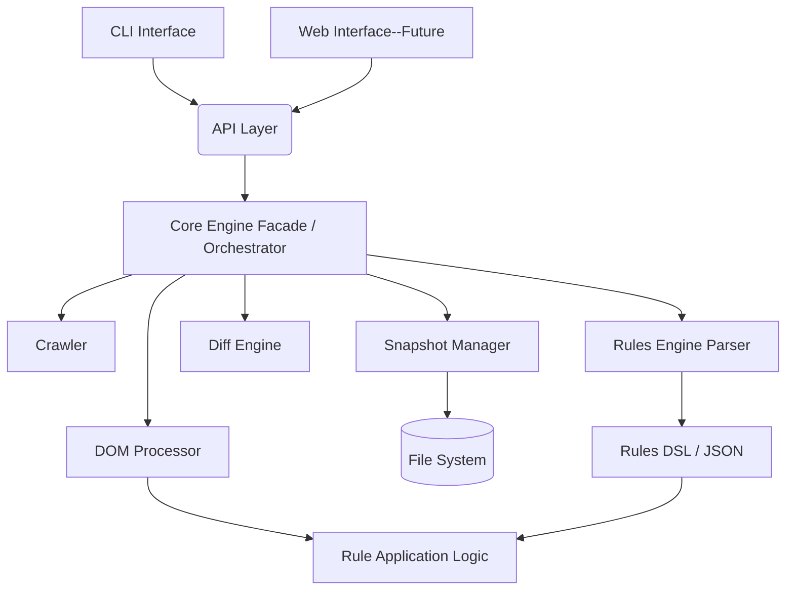

<PRD>
# Product Requirements Document: Website Content Diff Tool (Breakcheck)

Version: 2.3
Date: 2025-04-28

_(Consolidates details from v1.0 into the v2.0 structure with the API Layer)_
_(Edited 2.1 slightly to make 2.2 - CB)_

## 1. Introduction

### 1.1 Purpose

This document outlines the requirements for a command-line interface (CLI) tool, **Breakcheck**, designed to assist developers and QA testers in verifying content-based websites after upgrades or significant changes (e.g., CMS updates, framework migrations, theme changes). The tool automates the process of comparing website states ("before" and "after" the change) to identify unexpected alterations in HTML content and structure, while allowing users to configure rules to ignore expected differences. **The core logic is encapsulated within distinct components and exposed via an internal API layer, which the CLI interacts with, paving the way for future interfaces like a web application.**

### **1.2 Scope**

Version 2.1 focuses on delivering a robust CLI application interacting with a well-defined internal API layer. It includes core functionalities: crawling, snapshotting, DOM processing based on configurable rules, content diffing, and reporting, all orchestrated via the API. Future versions may introduce a web-based user interface leveraging this API and potentially expose the API over a network.

### **1.3 Goals & Objectives**

- **Goal:** Reduce the manual effort and improve the accuracy of regression testing for content-based websites undergoing upgrades or changes.
- **Objective 1:** Provide a reliable mechanism (**via the API**) to capture the state of a website (HTML content and structure) before and after a change using a configurable crawler.
- **Objective 2:** Implement a flexible rules engine using a clear DSL, configurable **via the API**, to allow users to precisely define which parts of the HTML should be included, excluded, or transformed during comparison.
- **Objective 3:** Develop an efficient diff engine capable of highlighting meaningful differences between the "before" and "after" states (after rule application), ignoring configured exceptions.
- **Objective 4:** Deliver a user-friendly CLI tool that interacts with the **Breakcheck API** for configuration, execution, and reviewing results.
- **Objective 5:** Define and implement a clear **API Layer** that encapsulates the core logic, facilitating modularity, testability, and future interface development (e.g., Web UI).

### 1.4 Target Audience

- Web Developers
- Quality Assurance (QA) Engineers / Testers
- DevOps Engineers
- Technical Project Managers involved in website upgrades/migrations.

## 2. User Personas & Scenarios

### 2.1 Persona: Frontend Developer (Maria)

- **Needs:** Quickly verify that a CMS theme update hasn't broken layouts or altered static content unexpectedly across hundreds of pages. Needs to ignore dynamic elements like cache-busting query parameters or CSRF tokens.
- **Scenario:** Maria uses the Breakcheck CLI tool. She runs breakcheck snapshot before --url .... The CLI calls the Breakcheck API's createSnapshot function. The API layer then invokes the Crawler component to scan the site and the Snapshot Manager to save the state. Later, she runs breakcheck compare before after --rules .... The CLI calls the API's runComparison function, passing snapshot identifiers and rules. The API retrieves snapshots, invokes the DOM Processor (applying rules parsed by the Rules Engine) and the Diff Engine. The API orchestrates the process, and the CLI displays the structured results returned by the API.

### 2.2 Persona: QA Engineer (David)

- **Needs:** Perform comprehensive regression testing after a major framework upgrade. Needs a detailed report of all structural and content changes, filtering out noise from minified scripts or style changes.
- **Scenario:** David uses the CLI similarly, relying on it to interact with the underlying Breakcheck API to perform snapshots and comparisons based on his specified configurations and rules. He defines rules to exclude entire `<script>` and `<style>` blocks and normalize specific attribute values. The API returns the filtered diff results, which the CLI presents, allowing him to focus his manual testing efforts.

## 3. Functional Requirements

### 3.1 Core Workflow (via API)

The tool, accessed initially via the CLI, shall support the following core workflow, orchestrated by the API Layer:

1. **Configuration:** Define target site URL, rule set, snapshot names via the client (CLI).
2. **Snapshot "Before":** Client (CLI) requests snapshot creation via the API Layer. API Layer invokes Crawler (with specified config) and Snapshot Manager.
3. _(Manual Step: User performs website upgrade/changes)_
4. **Snapshot "After":** Client (CLI) requests another snapshot creation via the API Layer.
5. **Comparison:** Client (CLI) requests comparison via the API Layer, providing snapshot identifiers and rules (either as text/path or pre-parsed JSON). API Layer retrieves snapshots, invokes the Rules Engine (to parse DSL if needed), the DOM Processor (to apply rules), and the Diff Engine.
6. **Reporting:** API Layer returns structured comparison results to the Client (CLI) for presentation.

### 3.2 Crawler Component (Crawlee)

_(Invoked by the API Layer)_

- **FR-CRAWL-01:** The crawler component must be able to recursively crawl a website starting from a given base URL, respecting configuration limits.
- **FR-CRAWL-02:** The crawler must capture the full HTML content of each discovered page.
- **FR-CRAWL-03:** The crawler must support fetching content via a headless browser (e.g., Playwright via Crawlee) to handle client-side rendered content.
- **FR-CRAWL-04:** The crawler must handle URL normalization (e.g., removing trailing slashes, handling case sensitivity based on config) to avoid duplicate page captures.
- **FR-CRAWL-05:** The crawler must accept configuration options passed from the API Layer (e.g., max depth, URL include/exclude patterns, request concurrency, user-agent).
- **FR-CRAWL-06:** The crawler must record the final URL (after redirects) and HTTP status code for each page.
- **FR-CRAWL-07:** The crawler must handle common errors gracefully (e.g., timeouts, 4xx/5xx errors) and report them back to the API Layer.
- **FR-CRAWL-08:** The crawler shall return a collection of PageSnapshot data (URL, content, headers, status, etc.) for the crawled site.

### 3.3 Snapshot Manager (File System, zlib)

_(Invoked by the API Layer)_

- **FR-SNAP-01:** The snapshot manager must store snapshots of crawled site states ("before" and "after") based on identifiers provided by the API Layer.
- **FR-SNAP-02:** Each snapshot must contain the collection of captured pages (URL, HTML content, headers, etc.) received from the crawler.
- **FR-SNAP-03:** Snapshots must be stored efficiently on the local file system (e.g., compressed archive like ZIP containing JSON data per page and metadata).
- **FR-SNAP-04:** Snapshots must include metadata provided by the API Layer: timestamp of crawl, base URL, crawl configuration used.
- **FR-SNAP-05:** The snapshot manager shall allow retrieval of specific snapshots by their identifier.
- **FR-SNAP-06:** (Optional) Implement content fingerprinting (e.g., SHA hash of HTML) for quick identification of unchanged pages during snapshot creation or loading.

### 3.4 DOM Processor (Cheerio, xpath)

_(Invoked by the API Layer during comparison)_

- **FR-DOM-01:** The DOM processor must parse the raw HTML content of a page into a traversable DOM structure (using Cheerio).
- **FR-DOM-02:** The DOM processor must apply baseline normalization rules (e.g., consistent whitespace handling - if configured).
- **FR-DOM-03:** The DOM processor must apply the user-defined rules (provided as parsed JSON by the API Layer, originating from the Rules Engine) to modify the DOM _before_ comparison. This includes element/attribute exclusion, inclusion, and transformation based on CSS/XPath selectors and regex.
- **FR-DOM-04:** The DOM processor shall return the processed/modified DOM structure ready for diffing.
- **FR-DOM-05:** Must support both CSS selectors (via Cheerio) and XPath expressions (via xpath library) for rule targeting.

### 3.5 Rules Engine & DSL (Chevrotain, JSON Schema)

_(Parsing invoked by API Layer, Application logic used by DOM Processor)_

- **FR-RULE-01:** Provide a clear, documented DSL (Domain Specific Language) for users to define comparison rules (as specified in breakcheck_dsl_v2).
- **FR-RULE-02:** The DSL must support rules for: include, exclude, remove_attr, rewrite_attr, rewrite_content.
- **FR-RULE-03:** The DSL must support both CSS selectors and XPath expressions for targeting.
- **FR-RULE-04:** Rule definitions shall be readable from configuration files (e.g., .breakcheckrc, .rules) or passed as text to the API.
- **FR-RULE-05:** The Rules Engine (or API Layer) must parse the DSL text into the intermediate JSON format (as specified in breakcheck_json_spec_v1).
- **FR-RULE-06:** The Rules Engine must validate the rule definitions against the defined structure (e.g., using JSON Schema or parser validation).
- **FR-RULE-07:** The rule application logic (within the DOM Processor) must correctly interpret the parsed JSON rules (mode, selectors, actions, modifiers) to modify the DOM.
- **FR-RULE-08:** The engine should handle rule order predictably (e.g., order of definition in the DSL/JSON array).

### 3.6 Diff Engine

_(Invoked by the API Layer)_

- **FR-DIFF-01:** The diff engine must compare two processed DOM structures (output from the DOM Processor for a corresponding 'before' and 'after' page).
- ~~REMOVE: **FR-DIFF-02:** The comparison must identify differences at both the structural level (elements/attributes added, removed, modified) and the content level (text changes within elements).~~
- **FR-DIFF-03:** The Diff Engine must operate on the DOMs _after_ normalization and rule application have occurred.
- **FR-DIFF-04:** The Diff Engine must produce a structured PageDiff object detailing the identified differences (type, location/selector, before/after snippets).
- **FR-DIFF-05:** The Diff Engine itself doesn't classify expected/unexpected; that filtering happens during DOM processing based on rules. It reports all differences found between the _processed_ DOMs.

### 3.7 Reporting

- **FR-REP-01:** The **API Layer** must aggregate DiffResult objects from the Diff Engine and return a structured summary report object (number of pages compared, pages with differences, etc.).
- **FR-REP-02:** The **API Layer** must write detailed differences to a file on disk and return the path to this file in the comparison result.
- **FR-REP-03:** The differences file must contain structured data (e.g., JSON) with differences grouped by page URL, providing context (selector/XPath, type of change, before/after snippets).
- **FR-REP-04:** The **CLI** must format the structured summary data received from the API into human-readable console output.
- **FR-REP-05:** The **API Layer** should return the comparison result as structured data (e.g., JSON) containing the summary and path to the differences file. The **CLI** will handle writing this to a file if requested (--output).
- **FR-REP-06:** (Optional) The **API Layer** could generate HTML diff report data. The **CLI** would handle saving this.

### 3.8 CLI Interface (Commander.js, interactive-commander, Ink)

- **FR-CLI-01:** The tool must be executable from the command line (breakcheck).
- **FR-CLI-02:** The CLI must provide commands (snapshot, compare, help, etc.).
- **FR-CLI-03:** The CLI must accept arguments and options for configuration (base URL, snapshot names, rule file path, output paths, crawler settings).
- **FR-CLI-04:** The CLI must **call the appropriate Breakcheck API functions** (e.g., createSnapshot, runComparison) to initiate actions.
- **FR-CLI-05:** The CLI must read configuration (e.g., rule file content) and pass necessary data structures or paths to the API Layer.
- **FR-CLI-06:** The CLI must receive structured results (or status updates/progress) from the API Layer.
- **FR-CLI-07:** The CLI must present results and errors received from the API Layer clearly to the user (using console output, potentially enhanced by Ink for progress/formatting).
- **FR-CLI-08:** The CLI shall not require a database connection or user login.

### **3.9 API Layer**

- **FR-API-01:** The API Layer must expose well-defined functions/methods for core operations:
  - createSnapshot(config: SnapshotConfig): `Promise<SnapshotResult>`
  - runComparison(config: ComparisonConfig): `Promise<ComparisonResult>`
  - (Potentially others: listSnapshots, getSnapshotDetails, validateRules)
- **FR-API-02:** The API Layer must accept configuration objects defining parameters for snapshots (URL, crawl settings) and comparisons (snapshot IDs/names, rules content or path or parsed JSON).
- **FR-API-03:** The API Layer must orchestrate the necessary calls to the Core Engine components (Crawler, Snapshot Manager, Rules Engine Parser, DOM Processor, Diff Engine) to fulfill requests.
- **FR-API-04:** The API Layer must handle parsing of the Rules DSL (if rules are passed as raw text) into the intermediate JSON format, invoking the Rules Engine parser.
- **FR-API-05:** The API Layer must return structured data representing the results of operations (e.g., snapshot metadata, comparison summary and detailed diffs).
- **FR-API-06:** The API Layer must implement robust error handling (catching errors from core components) and return meaningful error objects/codes to the client (CLI).
- **FR-API-07:** For v2.1, the API Layer will be implemented as an internal Typescript interface/module within the same codebase as the CLI.

## 4. Non-Functional Requirements

- **NFR-PERF-01:** Crawling should be reasonably fast; leverage parallel requests (configurable concurrency).
- **NFR-PERF-02:** DOM processing and diffing should be efficient, handling potentially large HTML documents without excessive memory consumption or processing time.
- **NFR-API-PERF-01:** The internal API call overhead should be minimal.
- **NFR-SCALE-01:** The tool should handle websites with a moderate number of pages (e.g., thousands) within reasonable timeframes.
- **NFR-USE-01:** The CLI interface must be intuitive and well-documented (--help output).
- **NFR-USE-02:** The Rules DSL syntax must be clear, well-documented, and relatively easy for technical users to learn. Error messages during rule parsing must be informative.
- **NFR-API-USE-01:** The internal API (Typescript interfaces/functions) must be well-defined and documented for internal use by the CLI or future clients.
- **NFR-MAINT-01:** The codebase must be written in Typescript, following best practices for code organization, readability, and type safety.
- **NFR-MAINT-02:** The architecture must be modular, aligning with the components outlined (Interface, API Layer, Core Components), to facilitate maintenance and future development. The API layer enforces this separation.
- **NFR-API-TEST-01:** The API Layer must have dedicated integration tests, mocking the underlying core components where appropriate, and testing interactions with real components.
- **NFR-EXT-01:** Design with extensibility in mind (e.g., plugin system for rules, adapters for CMS-specific normalization, strategy pattern for diff algorithms) potentially exposed via the API layer.
- **NFR-SEC-01:** Handle user-provided configurations (like URLs, file paths) safely within the CLI and API layer. Avoid command injection or insecure file access.
- **NFR-API-SEC-01:** (Future) If the API becomes network-accessible, appropriate security measures (authentication, authorization, input validation, rate limiting) must be implemented.
- **NFR-REL-01:** The tool should be reliable and produce consistent comparison results for the same inputs and rules.

## 5. System Architecture

- **Updated Diagram Concept:**

- **Components:**
  - **Interface:** CLI (v2.1), Web UI (Future). Responsible for user interaction, input gathering, calling the API Layer, and presenting results.
  - **API Layer:** Acts as the primary entry point for clients. Validates requests, orchestrates calls to the Core Engine components, invokes DSL parsing, handles errors, formats responses. Implemented internally in v2.1.
  - **Core Engine Components:**
    - **Crawler:** Discovers and fetches pages.
    - **Snapshot Manager:** Saves and retrieves website states.
    - **Rules Engine Parser:** Parses DSL text into intermediate JSON.
    - **DOM Processor:** Parses HTML, applies normalization and parsed rules.
    - **Diff Engine:** Compares two processed DOMs.
  - _(The "Core Engine Facade" might be implicitly part of the API Layer's implementation)_
- **Technologies:** Typescript, Crawlee, Cheerio, xpath, diff (jsdiff), Chevrotain, Commander.js, interactive-commander, Ink, zlib.
- **Data Flow:** Interface -> API Layer -> (Rules Parser ->) Crawler/SnapshotMgr/DOMProcessor/DiffEngine -> File System/Results -> API Layer -> Interface.

## 6. Data Management

- **DM-01:** Snapshots will be stored on the local file system in a user-specified or default location.
- **DM-02:** Snapshot format will be a compressed archive (e.g., ZIP) containing structured data (e.g., JSON files per page) and metadata.
- **DM-03:** Rule configurations will be stored in separate files (e.g., .breakcheckrc) managed by the user, read by the CLI/API.
- **DM-04:** Detailed comparison differences will be stored in JSON files on disk, with paths returned in the comparison result.
- **DM-05:** No database is required for v2.1.

## 7. Testing Strategy

- **TS-01:** Adopt a Test-Driven Development (TDD) approach where feasible.
- **TS-02:** **Unit Tests:** For individual functions/classes within Core Components (Crawler adapters, Snapshot Manager logic, DOM processing utils, Diffing utils, Rules Parser) AND the API Layer's internal logic (e.g., request validation, orchestration logic - mocking core components).
- **TS-03:** **Integration Tests:**
  - Test interactions _between_ Core Components (e.g., DOM Processor using parsed rules).
  - Test the **API Layer's interaction with the real Core Components** for key flows (createSnapshot, runComparison).
  - Test the **CLI's interaction with the (mocked or real) API Layer**.
- **TS-04:** **End-to-End (E2E) Tests:** Simulate full CLI workflow (breakcheck snapshot ..., breakcheck compare ...) using sample websites and rule files, verifying final console output or generated reports. This implicitly tests the entire stack including the API layer.
- **TS-05:** **Rule DSL Tests:** Specific tests for the DSL parser (Chevrotain) verifying correct JSON output and error handling for various syntaxes.
- **TS-06:** **Crawler Tests:** Test crawler configuration options using mock HTTP servers or controlled test websites.

## 8. Future Considerations

- **FC-01:** **Web Interface:** Develop a web UI that directly consumes the **Breakcheck API**.
- **FC-02:** **Network API:** Expose the internal API Layer over a network (e.g., REST, JSON-RPC) for remote access or integration with other tools. Requires adding authentication/authorization.
- **FC-03:** **Visual Diff Tools:** Integrate or develop visual diffing capabilities (screenshot comparison or side-by-side rendering) potentially triggered and managed via the API.
- **FC-04:** **Plugin System:** Formalize a plugin architecture (e.g., for custom rule actions, reporters, snapshot storage) potentially managed via the API.
- **FC-05:** **API / CI/CD Integration:** Provide clear documentation and potentially client libraries for using the (future network) API in automated CI/CD pipelines.
- **FC-06:** **Screenshot Comparison:** Add optional screenshot capture during crawl and comparison capabilities (visual regression testing).
- **FC-07:** **REST API:** Add REST API implementing 202 / Polling approach for long running jobs like snapshot.

## 9. Out of Scope (for v2.1)

- Web-based user interface.
- Network-accessible API (the API is internal only).
- Database storage for snapshots or results.
- User authentication or multi-user support for the API.
- Visual diffing (screenshot comparison or side-by-side rendering).

## 10. Glossary

- **API Layer:** The software interface that exposes Breakcheck's core functionalities (snapshotting, comparison) and orchestrates the underlying components. Acts as an intermediary between clients (like the CLI) and the core engine.
- **Core Engine Components:** The collection of specialized modules performing the main tasks (Crawling, Snapshot Management, Rule Parsing, DOM Processing, Diffing, etc.), invoked via the API Layer.
- **Page:** An individual captured page.
- **Snapshot:** A representation of the website's state at a specific point in time, containing crawled URLs and their corresponding HTML content, stored by the Snapshot Manager.
- **Page Diff:** A before / after comparison of a particular page as identified by URL.
- **Snapshot Diff:** A before / after comparison of a entire snapshots.
- **DOM (Document Object Model):** A structured representation of an HTML document used for processing.
- **DSL (Domain Specific Language):** The specialized language used in Breakcheck rule files (.breakcheckrc) to define comparison behavior.
- **Rules Engine:** The combination of the DSL Parser and the Rule Application Logic within the DOM Processor.
- **CSS Selector:** A pattern used to select specific HTML elements.
- **XPath (XML Path Language):** A query language for selecting nodes from an HTML document.
- **Normalization:** Transforming data into a standard format before processing or comparison.
- **Transformation:** Modifying specific parts of the content based on rules.
- **CLI:** Command-Line Interface.

</PRD>
