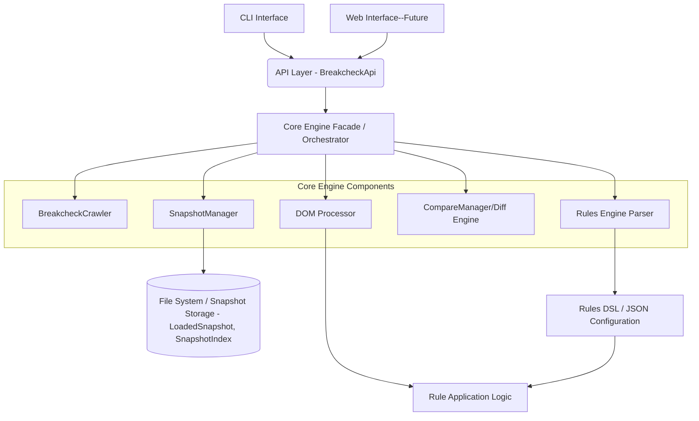

# **Breakcheck System Architecture**

## **Prompt**

As an expert in AI-assisted software development, I want you to design a system architecture for a tool that will help me test content-based websites that are built on a CMS or framework. The tool will be written in Typescript.
OUTPUT:

- A high-level system architecture mermaid diagram
- A list of the key components and the technologies that should be used for each component
- A list of the APIs that will be required for the components to interact with each other

CONTEXT:
I want to build a tool for testing content-based websites that are built on a CMS or framework. I intend to use Typescript for most of the tool.
It will work by crawling the site to be upgraded and taking a snapshot as the "before" state. The snapshot would consist of the HTML content of the site and a list of URLs. After the user has performed the site upgrade, a second crawl would be performed and an "after" snapshot would be stored. The tool would then do a page-level diff of the before and after snapshots to find unexpected differences.
Many CMSs and frameworks will minify Javascript and CSS, or add cache-busting attributes or URLs. The tool will then do a refining stage where it parses the DOM tree and allows a rules-based DSL to explicitly include or exclude parts of the page markup. I imagine using Xpath or CSS selector syntax for this. Additionally the tool can rewrite parts of HTML tags or attributes to remove or modify some of the differing text.
The overall strategy is to compare before and after an upgrade, looking for unexpected changes while ignoring the parts we expect to change.
In the future I may wish to add visual tools to assist users in refining the diffs to reduce the need to directly write the DSL syntax.
Initially, I'd want to run the tool as a CLI, but design it with a web interface in mind for the future. The CLI would not require a database or login, but the web interface would.
I'd like to use existing open source libraries for as much of the tool as possible. EG: web crawling, DOM parsing, CLI, etc. The web interface may be in a different language, so don't include that in the output

## **Architecture Document**



- **Initial Interaction:** The CLI (or future Web Interface) interacts primarily with the **API Layer** (represented by `BreakcheckApi`).
- **Orchestration:** The **API Layer** receives requests, validates them, and orchestrates the necessary calls to the **Core Engine Components** (BreakcheckCrawler, SnapshotManager, DOM Processor, CompareManager/Diff Engine, Rules Engine Parser) to fulfill the request. It handles tasks like parsing Rules DSL if provided as text.
- **Results:** The **API Layer** aggregates results from the components and returns a structured response to the calling interface.

### **Key Components & Technologies**

1.  **BreakcheckCrawler Component**
    - **Tech**: Crawlee (`crawlee`)
    - **Responsibility**: Site discovery, HTML capture (resulting in `PageSnapshot` objects), URL normalization. _Invoked by the API Layer with specific configuration (`CrawlerConfig`)._
2.  **SnapshotManager**
    - **Tech**: Compression (e.g., `zlib`), Storage (File system - local JSON/`gzip` compressed files for pages, `metadata.json`, `index.json` representing `SnapshotIndex`). Manages `LoadedSnapshot` for on-demand page access.
    - **Responsibility**: Storing/retrieving versioned site states (snapshots), managing metadata (`SnapshotMetadata`, `SnapshotIndex`). _Invoked by the API Layer._ Provides `SnapshotSummary` for listing.
3.  **DOM Processor**
    - **Tech**: Cheerio (`cheerio`), `xpath` (XPath library)
    - **Responsibility**: Parsing HTML from `PageSnapshot.content`, applying normalization, applying rules (via CSS/XPath selectors) received from the API Layer. _Invoked by the API Layer during comparison._
4.  **CompareManager/Diff Engine**
    - **Tech**: `diff` (specifically `diffLines` from the `diff` package)
    - **Responsibility**: Comparing two processed page contents (`PageSnapshot.content`) provided by the API Layer (via `SnapshotManager.getPage`), identifying differences (`LineDifference`). Aggregates `PageDiff` into `SnapshotDiff`. _Invoked by the API Layer._
5.  **Rules Engine Parser**
    - **Tech**: Chevrotain (DSL parser), JSON Schema (validation)
    - **Responsibility**: Parsing the Rules DSL text into a structured format (e.g., JSON) for use by the DOM Processor. _Invoked by the API Layer when rules are provided as text._ The _application_ of parsed rules happens within the DOM Processor.
6.  **CLI Interface**
    - **Tech**: `commander`, `interactive-commander`, `pino` (for logging)
    - **Responsibility**: User interaction, command parsing (e.g., `snapshotCommand`, `compareCommand`, `listSnapshotsCommand`), configuration gathering, **calling the API Layer (`BreakcheckApi`)**, presenting results received from the API Layer.
7.  **API Layer** (`BreakcheckApi` class)
    - **Tech**: Typescript interfaces/modules (Internal for v2.1)
    - **Responsibility**: Provides the primary interface for clients (CLI, future Web UI). Orchestrates core component interactions (e.g., `createSnapshot` function in `api/snapshot.ts`, `SnapshotManager`, `BreakcheckCrawler`), handles rule parsing invocation, validates inputs, formats outputs (`SnapshotResult`, `ComparisonResult`), manages errors.

### **Primary API (Exposed by API Layer - `BreakcheckApi`)**

This section defines the main interface clients use to interact with Breakcheck's core functionality, as exposed by the `BreakcheckApi` class.

```typescript
// Main API Class (src/api/index.ts)
export class BreakcheckApi {
  /**
   * Creates a snapshot of a website based on the provided configuration.
   * Orchestrates calls to Crawler and Snapshot Manager.
   */
  async createSnapshot(config: SnapshotConfig): Promise<SnapshotResult>;

  /**
   * Runs a comparison between two snapshots using specified rules.
   * Orchestrates calls to Snapshot Manager, Rules Engine Parser (if needed),
   * DOM Processor, and Diff Engine.
   * (Note: Implementation for runComparison is pending as per code)
   */
  async runComparison(config: ComparisonConfig): Promise<ComparisonResult>;

  /**
   * Lists all available snapshots with their details
   */
  async listSnapshots(): Promise<SnapshotSummary[]>; // Updated to reflect SnapshotManager.listSnapshots return type
}

// --- Supporting Input/Output Types (from src/types/api.ts, src/types/crawler.ts, src/types/compare.ts, src/core/snapshot/index.ts) ---

// From src/types/api.ts
export interface SnapshotConfig {
  baseUrl: string;
  name: string;
  crawlSettings: CrawlerConfig; // Defined in src/types/crawler.ts
  urlListPath?: string;
}

export interface SnapshotResult {
  success: boolean;
  snapshotId: string;
  timestamp: string;
  baseUrl: string;
  pageCount: number;
  errors: Array<{
    url: string;
    message: string;
    code?: string;
  }>;
  metadata: {
    crawlSettings: CrawlerConfig; // Defined in src/types/crawler.ts
    duration: number; // in milliseconds
  };
  urlListPath?: string;
}

export interface ComparisonConfig {
  beforeSnapshotId: string;
  afterSnapshotId: string;
  rules: string | object; // Can be raw DSL text or pre-parsed JSON
}

export interface ComparisonResult {
  success: boolean;
  summary: {
    totalPages: number;
    pagesWithDifferences: number;
    totalDifferences: number;
  };
  differences: Array<{
    // This structure is from the PRD, actual PageDiff is simpler for now
    url: string;
    differences: Array<{
      // Current PageDiff uses LineDifference[]
      type: "element" | "attribute" | "content"; // PRD detail
      selector: string; // PRD detail
      before?: string; // PRD detail
      after?: string; // PRD detail
      message: string; // PRD detail
    }>;
  }>;
  // Actual PageDiff from src/types/compare.ts for line-based diff:
  // pageDiffs: PageDiff[];
  // newUrls: string[];
  // removedUrls: string[];
  errors: Array<{
    url: string;
    message: string;
    code?: string;
  }>;
}

// From src/types/crawler.ts
export interface CrawlerConfig {
  baseUrl: string;
  maxDepth?: number;
  maxRequests?: number;
  maxConcurrency?: number;
  includePatterns?: string[];
  excludePatterns?: string[];
  userAgent?: string;
  crawlerType: "cheerio" | "playwright"; // CrawlerType
}

export interface PageSnapshot {
  url: string;
  finalUrl: string;
  content: string;
  statusCode: number;
  headers: Record<string, string>;
  title?: string;
}

// From src/core/snapshot/index.ts (internal but relevant for API interaction context)
interface SnapshotMetadata {
  // Used by SnapshotManager internally
  baseUrl: string;
  timestamp: string;
  crawlSettings: CrawlerConfig;
}

export class LoadedSnapshot {
  // Returned by SnapshotManager.loadSnapshot
  public readonly metadata: SnapshotMetadata;
  public readonly index: SnapshotIndex; // Defined in src/types/snapshot.ts
  async getPage(url: string): Promise<PageSnapshot | null>;
}

interface SnapshotSummary {
  // Returned by SnapshotManager.listSnapshots
  name: string;
  date: string;
  pageCount: number;
  errorCount: number;
}

// From src/types/snapshot.ts
export interface SnapshotIndex {
  urls: {
    [url: string]: {
      filename: string;
      statusCode: number;
      finalUrl?: string;
      pageTitle?: string;
    };
  };
  metadata: {
    baseUrl: string;
    timestamp: string;
    totalPages: number;
  };
}

// From src/types/compare.ts
export type LineDifference = import("diff").Change; // Equivalent to Change from diff package

export interface PageDiff {
  url: string;
  differences: LineDifference[];
  hasDifferences: boolean;
}

export interface SnapshotDiff {
  // Returned by CompareManager.compareSnapshots
  pageDiffs: PageDiff[];
  newUrls: string[];
  removedUrls: string[];
}
```

### **Architectural Considerations**

1.  **Extensibility Patterns**
    - Plugin system for custom rule types (potentially managed via API Layer).
    - Adapter pattern for CMS-specific normalizers.
    - Strategy pattern for diff algorithms.
2.  **Performance Optimizations**
    - Parallel crawl execution (configured via API Layer, e.g., `maxConcurrency` in `CrawlerConfig`).
    - Efficient DOM processing and diffing.
    - On-demand page loading in `LoadedSnapshot` via `getPage` method.
3.  **Future Web Interface Hooks**
    - The API Layer (`BreakcheckApi`) provides the natural integration point (potentially via a network wrapper like REST/JSON-RPC in the future).
    - Standardized JSON result format from the API Layer (e.g., `SnapshotResult`, `ComparisonResult`).
    - Audit trail metadata can be managed by the API Layer.

This updated architecture aligns with the PRD v2.3 and the provided codebase, emphasizing the `BreakcheckApi` Layer for better modularity, testability, and future extensibility (like adding a Web UI). It leverages TypeScript's type system and relies on appropriate OSS libraries for core functionality.
