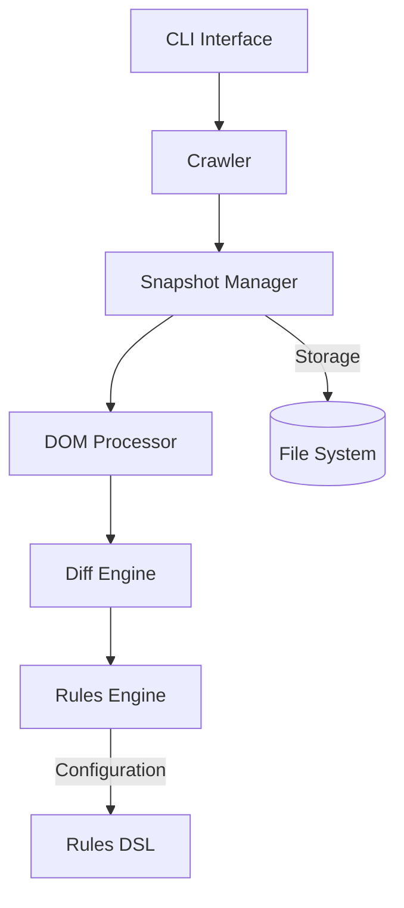

# Breakcheck System Architecture

## Prompt

As an expert in AI-assisted software development, I want you to design a system architecture for a tool that will help me test content-based websites that are built on a CMS or framework. The tool will be written in Typescript.

OUTPUT:

- A high-level system architecture mermaid diagram
- A list of the key components and the technologies that should be used for each component
- A list of the APIs that will be required for the components to interact with each other

CONTEXT:

I want to build a tool for testing content-based websites that are built on a CMS or framework. I intend to use Typescript for most of the tool.

It will work by crawling the site to be upgraded and taking a snapshot as the "before" state. The snapshot would consist of the HTML content of the site and a list of URLs. After the user has performed the site upgrade, a second crawl would be performed and an "after" snapshot would be stored. The tool would then do a page-level diff of the before and after snapshots to find unexpected differences.

Many CMSs and frameworks will minify Javascript and CSS, or add cache-busting attributes or URLs. The tool will then do a refining stage where it parses the DOM tree and allows a rules-based DSL to explicitly include or exclude parts of the page markup. I imagine using Xpath or CSS selector syntax for this. Additionally the tool can rewrite parts of HTML tags or attributes to remove or modify some of the differing text.

The overall strategy is to compare before and after an upgrade, looking for unexpected changes while ignoring the parts we expect to change.

In the future I may wish to add visual tools to assist users in refining the diffs to reduce the need to directly write the DSL syntax.

Initially, I'd want to run the tool as a CLI, but design it with a web interface in mind for the future. The CLI would not require a database or login, but the web interface would.

I'd like to use existing open source libraries for as much of the tool as possible. EG: web crawling, DOM parsing, CLI, etc. The web interface may be in a different language, so don't include that in the output

## Architecture Document



### Key Components & Technologies

1. **Crawler Component**

   - **Tech**: Crawlee (https://crawlee.dev)
   - **Responsibility**:
     - Site discovery through recursive crawling
     - HTML content capture with headless browser support
     - URL normalization and deduplication

2. **Snapshot Manager**

   - **Tech**:
     - Compression: zlib
     - Storage: File system (local JSON/ZIP)
   - **Responsibility**:
     - Versioned storage of before/after states
     - Metadata tracking (timestamps, crawl configs)
     - Content fingerprinting (SHA hashes)

3. **DOM Processor**

   - **Tech**:
     - Cheerio (https://github.com/cheeriojs/cheerio)
     - xpath (XPath selector library)
   - **Responsibility**:
     - DOM normalization (whitespace, attribute ordering)
     - Rule application via CSS/XPath selectors
     - Content transformation pipeline

4. **Diff Engine**

   - **Tech**:
     - fast-diff (https://github.com/jhchen/fast-diff)
     - html-differ (structural HTML comparison)
   - **Responsibility**:
     - Semantic HTML comparison
     - Change classification (expected/unexpected)
     - Visual diff generation (HTML output)

5. **Rules Engine**

   - **Tech**:
     - Chevrotain (DSL parser)
     - JSON Schema (rule validation)
   - **Responsibility**:
     - Rule interpretation and execution
     - Selector optimization
     - Rule conflict resolution

6. **CLI Interface**
   - **Tech**:
     - Commander.js (https://github.com/tj/commander.js)
     - Ink (React CLI components)
   - **Responsibility**:
     - Configuration management
     - Interactive mode with progress reporting
     - Result visualization

### Critical APIs

1. **Crawler API**

```typescript
interface Crawler {
  crawl(baseUrl: string): Promise;
}

interface CrawlResult {
  pages: PageSnapshot[];
  sitemap: SiteGraph;
}

interface PageSnapshot {
  url: string;
  content: string;
  fingerprint: string;
  headers: Record;
}
```

2. **DOM Processing API**

```typescript
interface DomProcessor {
  normalize(html: string): string;
  applyRules(html: string, rules: RuleSet): ProcessedDOM;
}

interface RuleSet {
  inclusions: SelectorRule[];
  exclusions: SelectorRule[];
  transformations: TransformRule[];
}

interface SelectorRule {
  target: "element" | "attribute";
  selector: string; // CSS/XPath
  scope: "content" | "structure";
}
```

3. **Diff API**

```typescript
interface DiffEngine {
  compare(before: ProcessedDOM, after: ProcessedDOM): DiffResult;
}

interface DiffResult {
  structuralDiffs: StructureChange[];
  contentDiffs: ContentChange[];
  visualDiff?: string; // HTML report
}

interface StructureChange {
  xpath: string;
  changeType: "added" | "removed" | "modified";
}

interface ContentChange {
  cssSelector: string;
  beforeState: string;
  afterState: string;
}
```

4. **Rules DSL Example**

```bash
# Sample Rules Syntax
exclude css:.cache-buster-id
include xpath://meta[@name="generator"]
transform attr:href /cdn/(.*)/ -> /static/$1/
```

### Architectural Considerations

1. **Extensibility Patterns**

   - Plugin system for custom rule types
   - Adapter pattern for different CMS-specific normalizers
   - Strategy pattern for diff algorithms

2. **Performance Optimizations**

   - Parallel crawl execution
   - DOM processing worker threads
   - Incremental diff computation

3. **Future Web Interface Hooks**
   - JSON-RPC interface for core engine
   - Result serialization format
   - Audit trail metadata

This architecture leverages TypeScript's type system for robust interfaces between components while using battle-tested OSS libraries for core functionality. The modular design allows for gradual enhancement while maintaining CLI focus.
